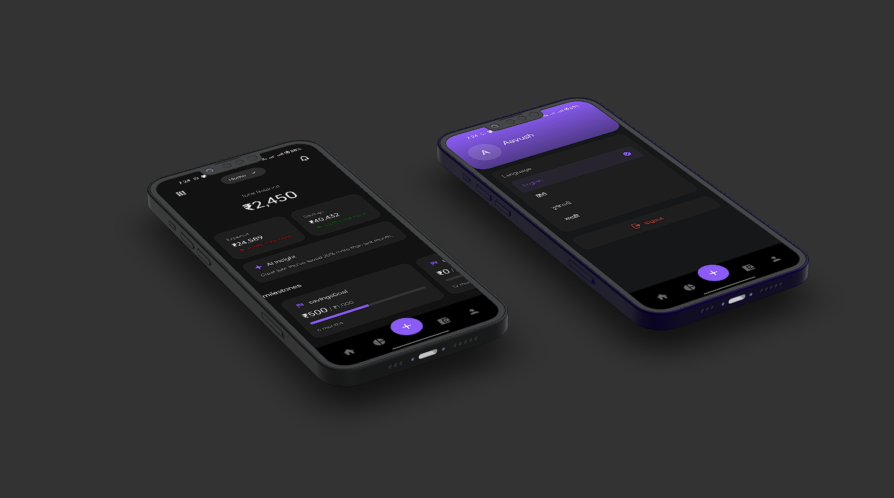

# 🇮🇳 Pockit – Your AI-Powered Indian Budgeting Buddy

> 🎯 **Transforming the way India plans, spends, and saves – one SMS at a time.**

**Pockit** is a modern, machine learning-powered personal finance app tailored for India. From chaotic UPI spends to festival splurges, Pockit gets it. We're here to decode your financial habits, forecast future expenses, and help you achieve your financial goals.

---

## 💸 Problem Statement

Despite the rise in digital payments and UPI usage, **financial planning remains a real struggle for Indian users**:

- Confusing SMS notifications from banks and apps  
- Irregular seasonal expenses (hello, Diwali!)  
- No personalized insights or cultural context in global apps  

---

## 🧠 Our Solution

Pockit uses **cutting-edge Machine Learning** to:

- 📨 **Read and understand your SMS** notifications  
- 🧠 **Classify and track expenses automatically**  
- 🔮 **Predict future expenses and optimize budgets**  
- 🗣️ **Talk to you like a financial buddy, not a boring dashboard**

---

## 🔍 ML Feature 1: Smart Categorization Engine

> *“Was that Paytm payment to BigBasket or a friend?”*

- 📤 Parses bank/UPI SMS using **NLP models** (Random Forest / BERT)  
- 🗂️ Classifies expenses into intuitive categories (food, rent, bills, etc.)  
- 🤖 Learns from your corrections and evolves over time  

---

## 📈 ML Feature 2: Dynamic Budgeting System

> *“Expecting a spike in shopping during Navratri? We got you.”*

- ⏱️ Time series forecasting with **LSTM** or **Prophet**  
- 📅 Predicts seasonal spikes and adjusts budgets dynamically  
- 🔄 Weekly budget recalibration based on spend patterns  

---

## 💬 ML Feature 3: Chat Assistant

> *"How much did I spend on Zomato last month?"*  

- 🤖 Powered by **OpenAI GPT-style models**  
- 🧾 Retrieves categorized data on demand  
- 💡 Offers **smart savings tips** based on your habits  

---

## 🇮🇳 Indian Touches That Make Us Unique

- 🕉️ **Sanskari Mode** – Local language UI (Hindi and more coming soon)  
- 🪔 **Festival Planner** – Budget prep for Diwali, Eid, and more  
- 🧠 **Spending Personality Profiler** – Are you a "Social Spender" or "Silent Saver"?  
- 🎁 **Gamified Goals** – Save ₹5000 and earn a Flipkart voucher  

---

## 🙌 Impact Story: Rohan’s Journey

> *“I never thought an app could actually change my spending behavior.”* – Rohan, 29, Pune

- 🍔 Cut food delivery expenses by 40%  
- 📈 Started his first SIP  
- 🎯 Is 60% closer to buying his dream iPad  

---

## ✨ Design Style

- Clean, minimal layout  
- Warm Indian color palette: **Saffron**, **Teal**, **Gold**  
- Icon-driven UX with modern fonts  
- Startup-pitch aesthetic, made for impact  

---

## 🚀 Built With

- Python, TensorFlow / PyTorch  
- HuggingFace Transformers, Prophet, LSTM  
- OpenAI API  
- React Native (UI)  

---

## 📬 Get Involved

We’re on a mission to help India spend smarter. If you’d like to collaborate, contribute, or join our early access program:

📧 **Email us** at hello@Pockit.ai  
🔗 **Visit** [Pockit.ai](https://Pockit.ai) *(coming soon)*  
🧑‍💻 **Open source contributions coming soon!*

---

> *“Pockit nahi, progress hai.”*
